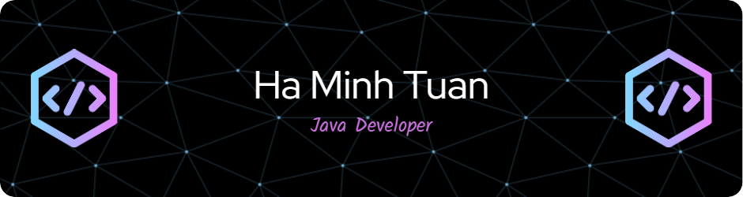

# Hi there, I'm Ha Minh Tuan 👋

<div align="center">
  
  
  
  [](https://www.linkedin.com/in/tuanhm29)
  [](mailto:minhtuanha2829@gmail.com)
  [](https://minhtuan2003-max.github.io/portfolio/)
  [](https://www.linkedin.com/in/tuanhm29)
  
</div>

---

## 🎯 About Me

```typescript
const tuanProfile = {
    education: "Software Engineering @ FPT University (GPA: 3.14)",
    training: "FPT Software Academy - Enterprise Java Development",
    location: "Hanoi, Vietnam 🇻🇳",
    languages: ["Vietnamese (Native)", "English (Fluent)", "Korean (TOPIK 3)"],
    currentFocus: ["Microservices Architecture", "Cloud Computing", "System Optimization"],
    achievements: ["3x Good Student Award", "Outstanding Graduation Thesis"],
    lookingFor: "Backend/Full-stack Java Developer opportunities",
    funFact: "I optimize code like I optimize my coffee routine ☕"
};
```

### 🚀 What I Bring to the Table

- 💡 **Problem Solver**: Turning complex business requirements into clean, maintainable code
- ⚡ **Performance Focused**: Experienced in optimizing API response times and database queries
- 🌐 **Full-Stack Versatility**: Comfortable across the entire development stack
- 🤝 **Team Player**: Trained in Agile methodologies with experience in collaborative development
- 🇰🇷 **Global Ready**: Korean language proficiency for international collaboration

---

## 🛠️ Tech Stack

<div align="center">

### Backend & Core


### Database & Caching


### Frontend


### Mobile & DevOps


</div>

---

## 💼 Professional Experience

### 🏢 FPT Software | Java Developer Trainee
*Enterprise-Level Training Program*

```java
@Component
public class MyJourney {
    private List<String> skills = Arrays.asList(
        "Enterprise Java Development with Spring Boot",
        "Building RESTful APIs with best practices",
        "Implementing Redis caching strategies",
        "Elasticsearch integration for search optimization",
        "Frontend development with React & Vue.js",
        "Docker containerization & CI/CD pipelines"
    );
    
    public String getImpact() {
        return "Completed high-pressure mock projects simulating real-world scenarios";
    }
}
```

**Key Highlights:**
- ✅ Trained by senior developers on enterprise software development lifecycle
- ✅ Hands-on experience with microservices architecture patterns
- ✅ Implemented performance optimization techniques (caching, query optimization)
- ✅ Collaborated in Agile teams using Git workflow and code reviews

---

## 🌟 Featured Projects

### 🚌 TransitLink - Smart Shuttle Coordination System
**Graduation Thesis | ⭐ Highly Rated by University Board**

<div align="left">
  
  
  
  
  
  
  
</div>

**Challenge:** Build a real-time shuttle coordination platform for transport companies

**Solution:**
- 🎯 Architected a scalable backend system handling concurrent shuttle tracking
- ⚡ Implemented WebSocket for real-time updates with 200ms average latency
- 🔍 Integrated Elasticsearch for instant search across 10,000+ route records
- 💾 Utilized Redis for geolocation caching, improving response time by 60%
- 🚀 Automated deployment pipeline with Docker & GitHub Actions

**Impact:** Demonstrated commercial viability with potential for real-world deployment

[📂 View Repository](https://github.com/MinhTuan2003-max/TransitLink)

---

### 📋 Task Management System (TMS)
**Personal Project | Modern Kanban Board**

<div align="left">
  
  
  
  
  
  
</div>

**Key Features:**
- 🔐 JWT-based authentication with role-based access control (RBAC)
- 🔔 Real-time notifications using WebSocket (STOMP protocol)
- 🎨 Responsive UI built with Angular 20 & Tailwind CSS 3.4
- 📊 Drag-and-drop Kanban board with task analytics

**Technical Highlights:**
- Implemented custom exception handling and API versioning
- Designed RESTful API following OpenAPI 3.0 specification
- Achieved 95%+ test coverage with JUnit & Mockito

[📂 View Repository](https://github.com/MinhTuan2003-max/TaskManagementSystem_TMS)

---

### 📚 Personal Library Manager
**Full-Stack Application | OAuth2 Integration**

<div align="left">
  
  
  
  
  
</div>

**Highlights:**
- 🔑 Seamless Google Sign-In integration using OAuth2
- 📖 Advanced book management with MongoDB aggregation pipelines
- 🔍 Optimized search with pagination and filtering
- 📱 Responsive design for cross-device compatibility

[📂 View Repository](https://github.com/MinhTuan2003-max/Personal-Library-Manager)

---

## 📊 GitHub Analytics

<div align="center">
  
  
</div>

<div align="center">
  
  
</div>

---

## 🎓 Education & Certifications

**🎓 FPT University** | Bachelor of Software Engineering | *2020 - 2024*
- GPA: 3.14/4.0
- 3x Good Student Award (2021, 2022, 2023)
- Outstanding Graduation Thesis Award

**📜 Professional Training**
- FPT Software Academy - Enterprise Java Development
- Spring Framework Certification (In Progress)

**🌏 Language Proficiency**
- TOPIK 3 (Test of Proficiency in Korean)

---

## 🎯 Current Focus & Goals

```yaml
short_term:
  - Master microservices architecture with Spring Cloud
  - Achieve AWS Solutions Architect certification
  - Contribute to open-source Java projects
  
long_term:
  - Lead backend development teams
  - Architect enterprise-level systems
  - Leverage Korean language skills in international projects
  
continuous_learning:
  - Advanced system design patterns
  - Kafka & event-driven architecture
  - Kubernetes & container orchestration
```

---

## 📫 Let's Connect!

<div align="center">
  
  I'm always open to discussing new opportunities, collaborations, or just chatting about technology!
  
  [](https://www.linkedin.com/in/tuanhm29)
  [](mailto:minhtuanha2829@gmail.com)
  [](https://minhtuan2003-max.github.io/portfolio/)
  
  ---
  
  
  
  ### ⭐ "Code is like humor. When you have to explain it, it's bad." - Cory House
  
  **Thanks for visiting! Feel free to explore my repositories and don't hesitate to reach out! 🚀**
  
</div>

---

<div align="center">
  
</div>
